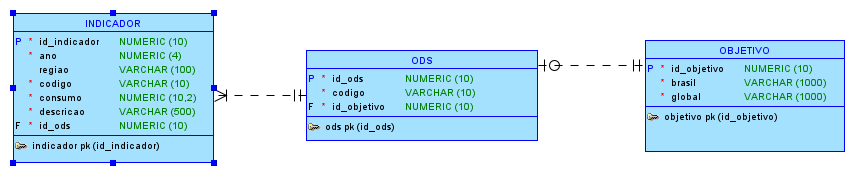
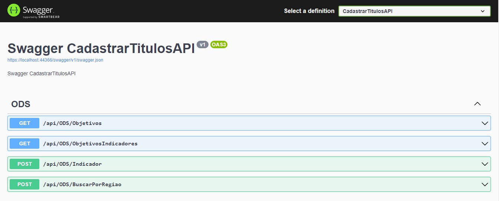
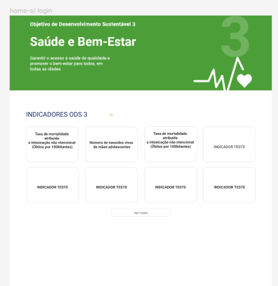
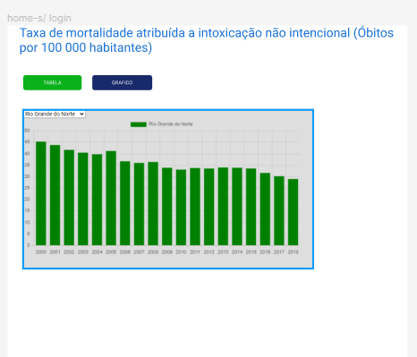
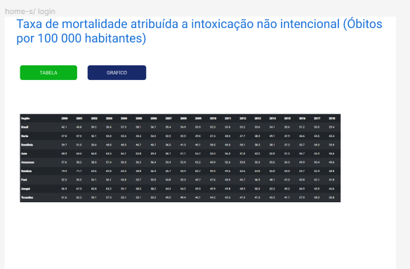
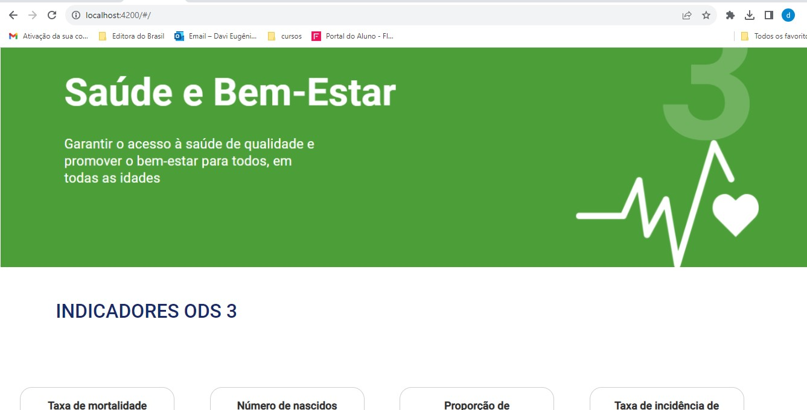
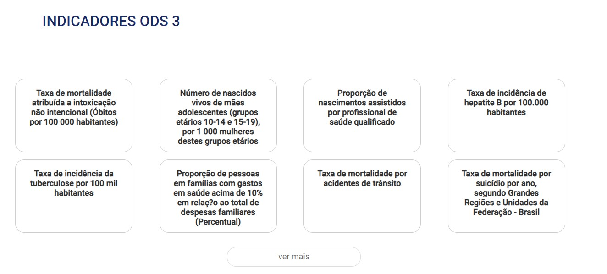
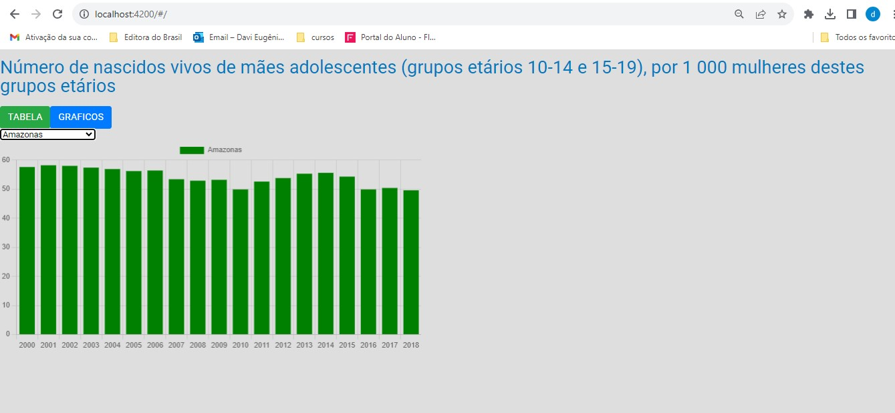
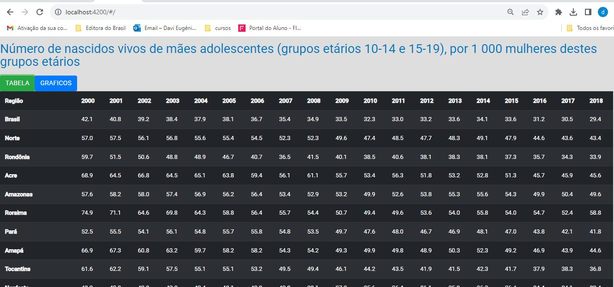
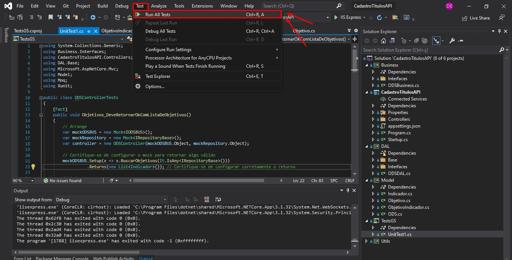

#  Global Solution - Microservice and Web Engineering Project

## Integrantes 
- Davi Yamane Eugenio - RM: 87221
- Gustavo Costa Pereira - RM: 87843
- Vitor Ramos Santos de Faria - RM: 88000

## Matéria e Professor 📖
- Matéria: Microservice and Web Engineering
- Professor: José Romualdo da Costa Filho
  
## Desenvolvimento da Aplicação
Para contribuir com esse objetivo global, desenvolvemos uma aplicação que utiliza diagramas e scripts para gerar datasets com dados de indicadores do ODS 3, Saúde e Bem-Estar. Estes dados são disponibilizados através de uma API, acessível tanto para consumo direto quanto para integração em outras aplicações.

Recursos Principais
APIs: Disponibilizam dados do ODS 3 de forma acessível e organizada, permitindo fácil integração em diferentes contextos.
Aplicação Frontend: Uma interface intuitiva para visualização e interação com os indicadores de saúde, tornando as informações mais acessíveis ao público em geral, com gráficos e filtros.
Docker: As aplicações estão disponíveis para uso intuitivo e conteinerizados com Docker.

## Front-end
O Front-end é um modulo do projeto para exibição dos dados trazidos pela API. Ele oferece as seguintes funções:

- Mostra um gráfico com as informações das metas ODS 3 dos anos anteriores;
- Mostra tabela com informações sobre as metas ODS 3 dos anos anteriores.

## API 
A API é um módulo do projeto dedicada ao gerenciamento de dados de clientes. Ela oferece uma variedade de funcionalidades, incluindo:

- Carrega os dados salvos no banco de dados (Objetivos, Indicados e ODS)
  
Todos os dados gerenciados por esta API são persistidos em um banco de dados SQL Server integrado ao projeto.

## Como utilizar 📄
Para consumir nossos serviço basta seguir os seguintes passos:

1 - [Criar tabelas no SQL Server](https://github.com/DaviYEugenio/MicroServi-o-GS/tree/main/BD)

2 - Para executar a API: Executar Dockerfile e abrir o seguinte [Link](https://localhost:44366/swagger/index.html)

3 - Para executar o Front: Executar Dockerfile que se encontra na pasta do projeto e abrir o seguinte [Link](http://localhost:4200/#/)

## Tecnologias Utilizadas 💻
O projeto foi desenvolvido utilizando as seguintes tecnologias:
- **C#**: Versão da linguagem de programação Java utilizada no projeto.
- **Angular**: Ferramenta de gerenciamento de dependências utilizada no projeto.
- **SQL Server**: Versão do Spring Boot utilizada no projeto.
- **Docker**: Tecnologia de contêiner utilizada para gerenciar e implantar aplicações de forma eficiente.
- **Microsoft Visual Studio**: Utilizamos o ambiente de desenvolvimento Microsoft Visual Studio IDE para a escrita, edição e depuração de código C# de forma eficaz.
- **SQL Developer**: Empregamos o SQL Developer como uma ferramenta robusta de administração e desenvolvimento de banco de dados Oracle SQL.
- **K6**: K6 é uma ferramenta de teste de carga e desempenho, utilizada para avaliar o comportamento do sistema sob diferentes condições de tráfego.
- **XUnit**: xUnit.net é uma ferramenta de teste de unidade gratuita e de código aberto para o .NET Framework, escrita pelo autor original do NUnit. O software também pode ser usado com .NET Core e Mono.

  
  
  
    

## Bando de dados 🎲
O Modelo Relaciona utilizado no banco de dados foi: 

## BACKEND
 ## Endpoints:
Endpoint GET/Objetivos

[https://localhost:44366/api/ODS/Objetivos](https://localhost:44366/api/ODS/Objetivos)

Endpoint POST/indicador/{codigo}

[https://localhost:44366/api/ODS/Indicador/3.1.1](https://localhost:44366/api/ODS/Indicador/3.1.1)

Endpoint POST/BuscarPorRegiao/{regiao}

[https://localhost:44366/api/ODS/BuscarPorRegiao/Brasil](https://localhost:44366/api/ODS/BuscarPorRegiao/Brasil)

Endpoint GET/ObjetivosIndicadores - ESTE ENDPOINT RETORNA O JSON QUE O PROFESSOR PEDIU NA PROVA - NÃO É UTILIZADO

[https://localhost:44366/api/ODS/ObjetivosIndicadores](https://localhost:44366/api/ODS/ObjetivosIndicadores)

## FRONTEND
 ## Link do wireframe no Figma:  
 
 [https://www.figma.com/file/WFwUK9dpe97lAWCtCOBaHI/Untitled?type=design&node-id=1-670&mode=design&t=vFTwudNWORHzWCeZ-0](https://www.figma.com/file/WFwUK9dpe97lAWCtCOBaHI/Untitled?type=design&node-id=1-670&mode=design&t=vFTwudNWORHzWCeZ-0)
 
 ## Prints do wireframe:
Página Inicial:

1- 

Página de Indicadores Grafico:

2- 

Página de Indicadores Tabela:

3- 

## Prints em execução:
Página Inicial:

Página Inicial Objetivos:

Página de Indicadores Grafico:

Página de Indicadores Tabela:

## TESTES
Instruções para execução dos testes de Integração:

PASSO 1: Abra a pasta da API - CadastroTitulosAPI no Visual Studio.
PASSO 2: Espere o projeto fazer o build
PASSO 3: Na aba superior do visual studio vai no menu "TEST"
PASSO 4: Apos clicar em "TEST" clique em "Run all tests"
**SEGUE PRINT COM PASSO A PASSO:**

OBS: PARA RODAR OS TESTES O PROJETO NÃO PODE ESTAR RODANDO

 
